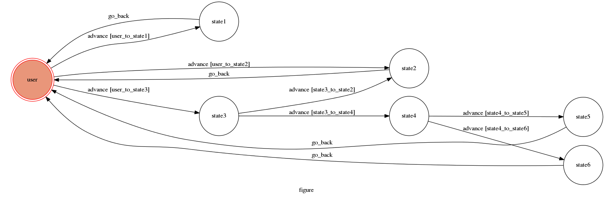

# TOC Project 2017

Final project of "theory of computation", Fall 2017.

A telegram bot based on a finite state machine

## Setup

### Prerequisite
* Python 3

#### Install Dependency
```sh
pip install -r requirements.txt
```

* pygraphviz (For visualizing Finite State Machine)
    * [Setup pygraphviz on Ubuntu](http://www.jianshu.com/p/a3da7ecc5303)

### Secret Data

`WEBHOOK_URL` in app.py **MUST** be set to proper values.
Otherwise, you might not be able to run your code.

### Run Locally
You can either setup https server or using `ngrok` as a proxy.

**`ngrok` would be used in the following instruction**

```sh
ngrok http 5000
```

After that, `ngrok` would generate a https URL.

You should set `WEBHOOK_URL` (in app.py) to `your-https-URL/hook`.

#### Run the sever

```sh
python3 app.py
```

## Finite State Machine


## Usage
The initial state is set to `user`.
Every time `user` state is triggered to `advance` to another state, it will  reply corresponding message.
After transforming to an ending states (there are 4 ending states）,   it will `go_back` to `user` state.

* user
	* Input: "書卷獎"
		* Reply: "哇！你好棒喔！"
	* Input: "all pass"
		* Reply: "加油！下學期拼卷"
	* Input: "被21"
		* Reply: "GG!有被21過嗎？"
		* Goto state3

* state3
	* Input: "沒有"
		* Reply: "加油！下學期拼卷"
	* Input: "有"
		* Reply: "你/妳是男生還是女生呢？"
		* Goto state4

* state4
	* Input: "男生"
		* Reply: "祝 當兵愉快：)"
	* Input: "女生"
		* Reply: "再考一次大學吧～"


## Author
[Justin-Bau](https://github.com/bauuuu1021)
